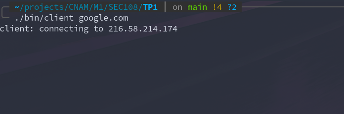
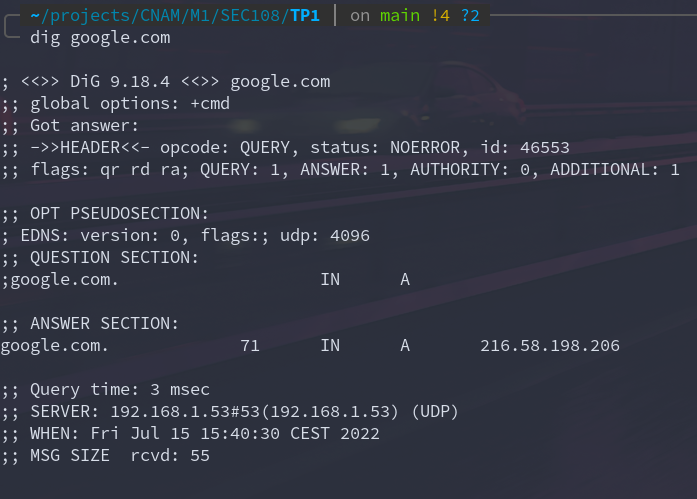
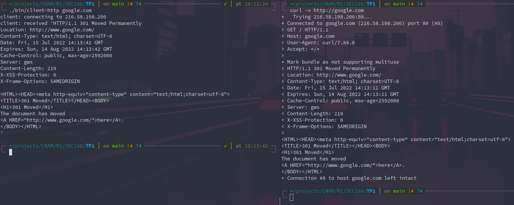

# SEC 108 - TP1 : Scan de Ports

## Utilisation du scanneur

Le scanner prend jusqu'à 3 arguments:

* `-sp <premier port à scanner>` ou `--startport <premier port à scanner>` 
* `-ep <dernier port à scanner>` ou `--endport <dernier port à scanner>` 
* `-mt <nb max de threads à utiliser>` ou `--maxthreads <nb max de threads à utiliser>` 

**Attention:** Par défaut (sans argument), le scan sera réalisé sur les 1024 premiers ports du host sur un seul thread.

**Exemple:**

```
# Scan complet de google.com (assez long)
bin/scanner google.com -sp 1 -ep 65535

# Scan multithread
bin/scanner google.com -sp 1 -ep 65535 --maxthreads 32
```

## Description du scanneur

Le scanneur réalise un SYNSCAN sur la range de port précisée en argument. Par défaut il est single threaded mais peut être éxécuté sur plusieurs threads avec l'option `maxthreads`, il trouvera alors le nombre de threads optimal en fonction du nombre de port. Si le nombre de threads n'est pas cohérent avec le nombre de port (ex: moins de ports que de threads), il s'éxécutera sur un seul thread. En multithread, le scanneur divise les ports à scanner en sous-groupes et les scan en parallèle.

La correspondance des services est établie avec le fichier `/etc/services` ce qui rend le scanneur uniquement utilisable sous Linux.

## Compilation d'un client en C

### Makefile du `client.c`

```Makefile
CC = gcc
CLIENT_SRC = src/client.c

all: client

client: $(CLIENT_SRC)
	$(CC) -o bin/client $(CLIENT_SRC)

clean:
	rm bin/*
```

Création du binaire via: `make client`

### Connection au port 80 de google.com



Le client initialise la connexion sur le port 80 et bloque.

```
socket(AF_INET, SOCK_STREAM, IPPROTO_TCP) = 3
connect(3, {sa_family=AF_INET, sin_port=htons(80), sin_addr=inet_addr("216.58.198.206")}, 16) = 0
newfstatat(1, "", {st_mode=S_IFCHR|0620, st_rdev=makedev(0x88, 0x2), ...}, AT_EMPTY_PATH) = 0
write(1, "client: connecting to 216.58.198"..., 37client: connecting to 216.58.198.206
) = 37
recvfrom(3, 
```

La commande strace montre que l'instruction `connect` a bien été éxécuté vers l'IP **216.58.198.206** qui correspond bien à l'IP renvoyée pour google.com



Cependant, le programme est en attente d'une réponse du serveur. L'instruction `recv` étant bloquante, le programme ne continue pas tant que la réponse n'a pas été reçu.

### Requête HTTP

En modifiant le code du `client.c` dans le nouveau `client-http.c` on rajoute une instruction pour envoyer une requête GET vers le hostname passé en argument: 

```C
char sendBuffer[512];
sprintf(sendBuffer, "GET %s HTTP/1.0 \r\nHost: %s\r\n\r\n", argv[2], argv[1]);
send(sockfd, sendBuffer, strlen(sendBuffer), 0);
```

Ce qui donne: 



Le résultat est équivalent à celui d'une requête GET via `curl`.

En lancant plusieurs fois la commande on remarque parfois des IP différentes. Google utilise des mécanismes de GSLB et de Load balancing classique pour répartir la charge des requêtes sur différents serveurs. Ceci explique les différentes IP observées.


## Écriture d'un scanner de ports

### Vitesse et SYNSCAN

Le scan des ports filtré en TCP connect est assez long car, la client n'ayant pas de réponse, la commande attend le timeout de la connexion pour se terminer. Une optimisation peut être réalisée en passant le socket en NON_BLOCK et précisant un temps de timeout prédéfini. Cependant, le SYNSCAN est bien plus efficace car il ne va pas au bout de la connexion TCP. Cela le rend également plus discret (mais pas totalement invisible en fonction de la configuration du FW).

